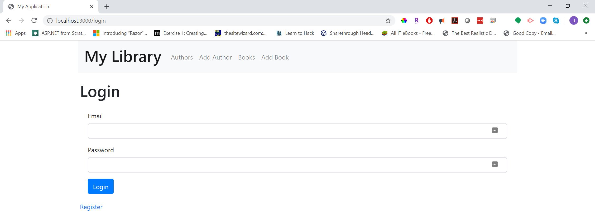
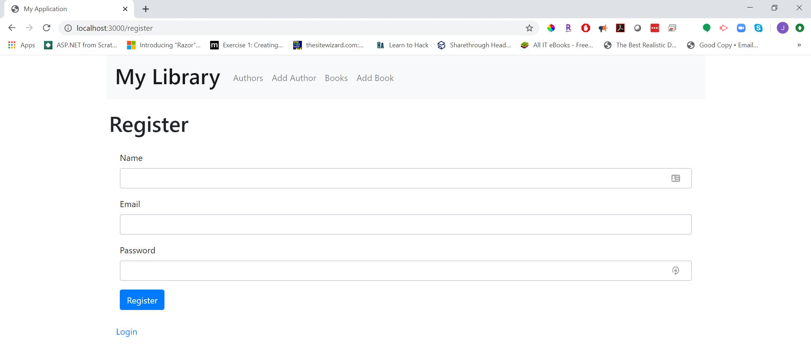
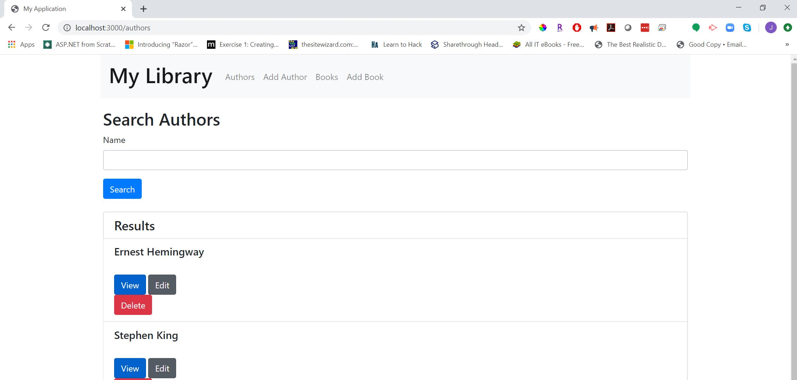
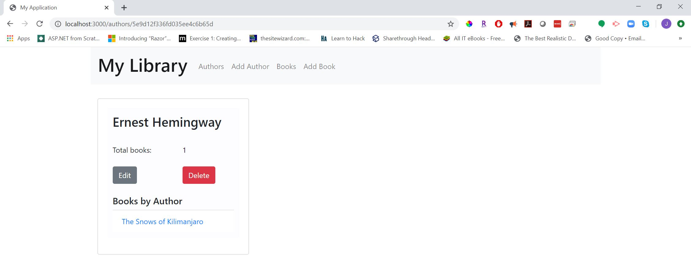
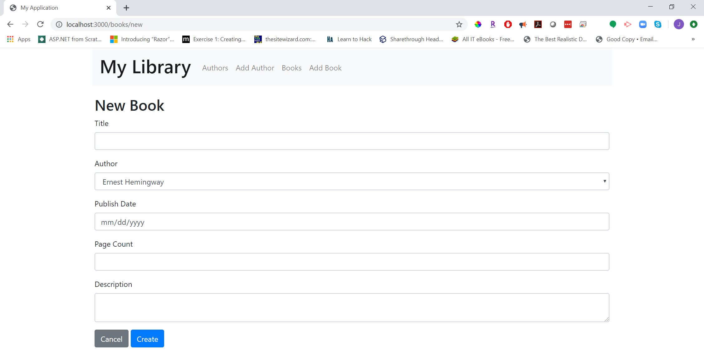
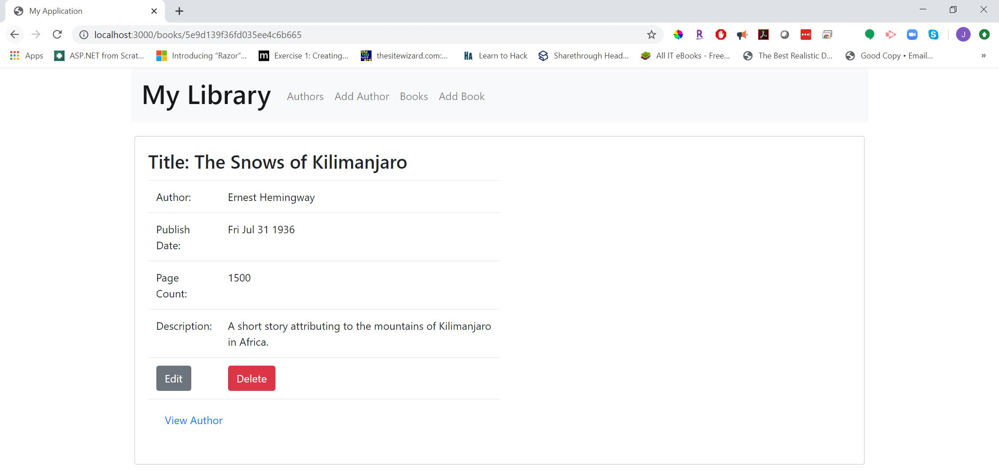
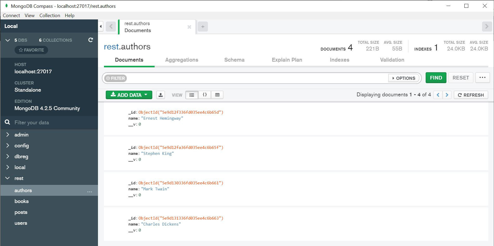

# Artifact Narrative

Artifact: Databases

**Describe the artifact**

The artifact for the Databases section of the portfolio initially came from the CS-340 Advanced Programming Concepts where we used MongoDB to manipulate data from a database. The original mongoDB scripts and database tables were stored in Codio were written in python. This artifact, while I plan to change the coding language, is being included in the ePortfolio because it will demonstrate my knowledge and skills with databases and building applications that interface with them. The original artifact will be improved because it will be re-written into an HTML and JavaScript structure, making it easier to interface with. Understanding how to write the scripts in Python will also be a great benefit in the event a user would like to run the script on a Linux OS.

**Justify inclusion**

In the beginning phases, I followed tutorials which built an application with NodeJS, Bootstrap, and MongoDB. This application is what I will be using in for this assignment and my next series of enhancements will include moving the databases from Codio to my working file structure and rewriting the Python scripts. I do like the new application as it is more applicable to real-world examples so I will plan to leave this in the final submission as well.

**Reflect on process and enhancements**

Following along to a tutorial made building this application a lot easier. It was a little difficult remembering the different routes but got the hang of it as the tutorial went along. I believe the biggest hurdle I faced was setting up the MongoDB client on my computer. In the CS-340 course, this client server was already set up appropriately to use MongoDB which we did not have to implement manually. I used the provided software MongoDB Compass to assist in building the server and ensuring it ran on my system. From there, the tutorial was straightforward. As I work on the next enhancements of downloading the other databases from Codio, I foresee some difficulty in integrating the new data into the working files but believe I will be able to work through these challenges.

## Screenshots of application

**Login Screen**

**Registration Screen**

**Search Authors**

**View Author**

**Add A Book**

**View A Book**

**View Database**

